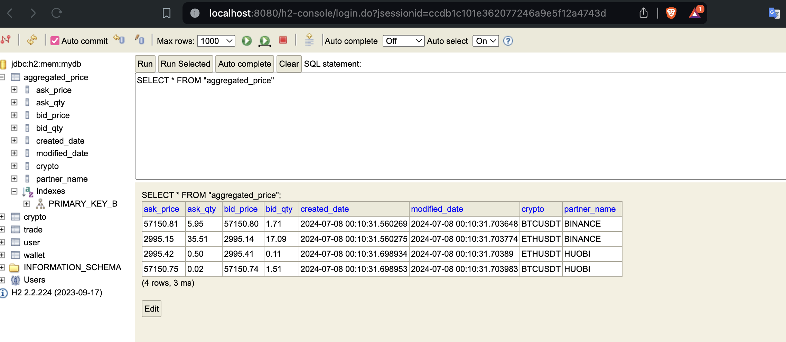
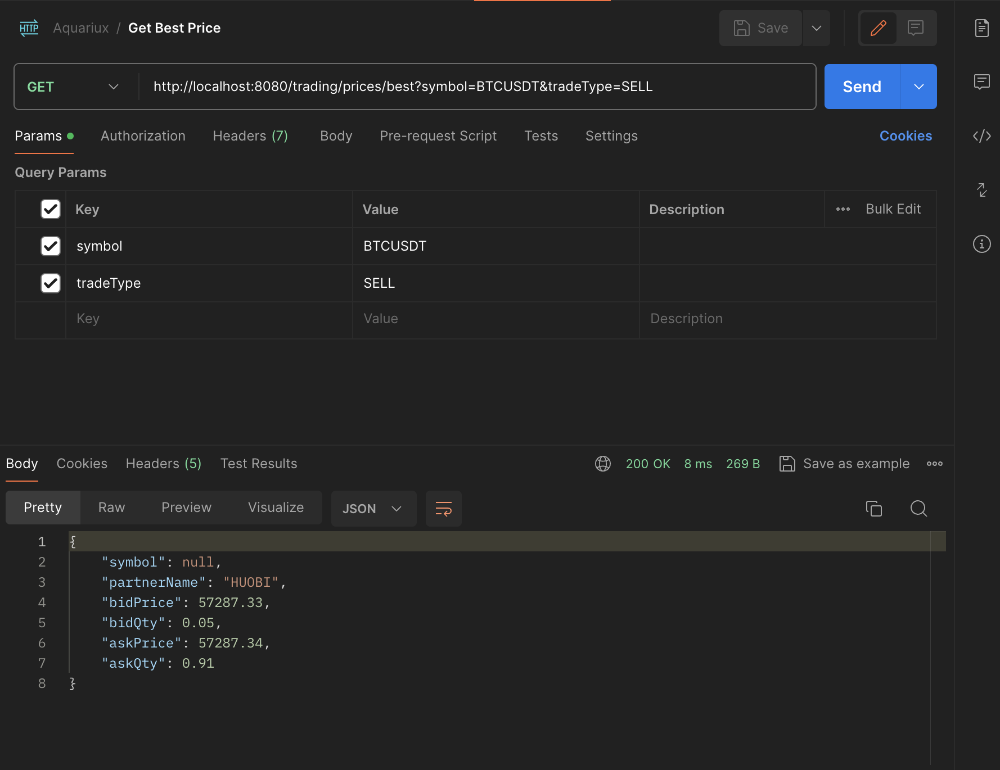
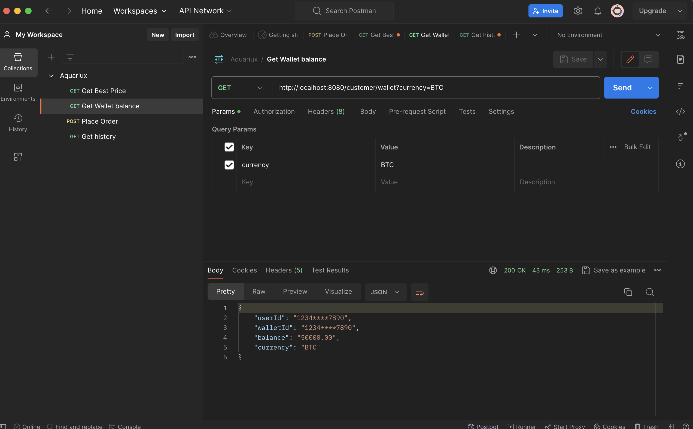
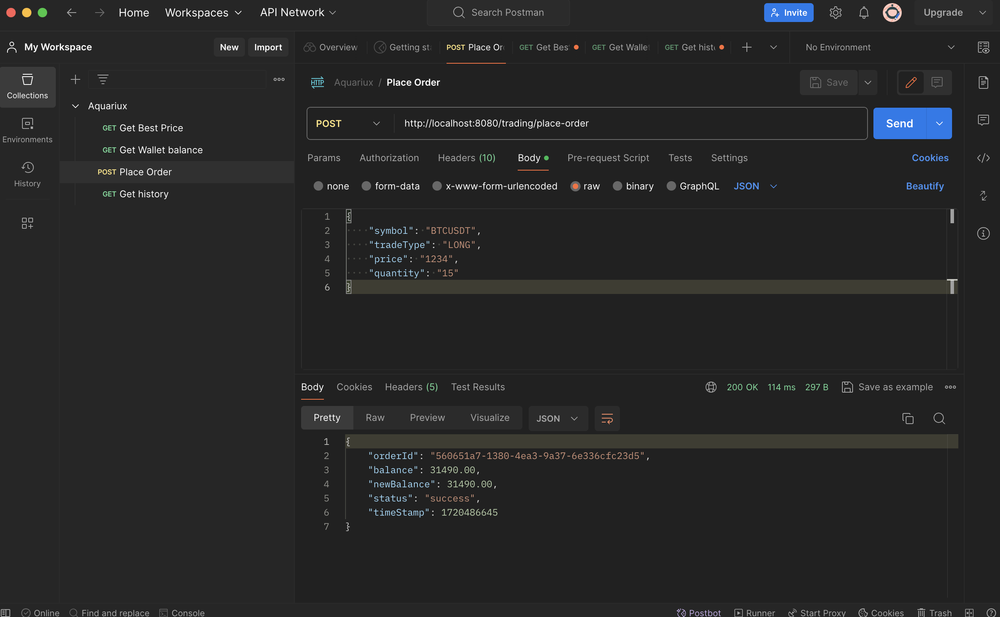
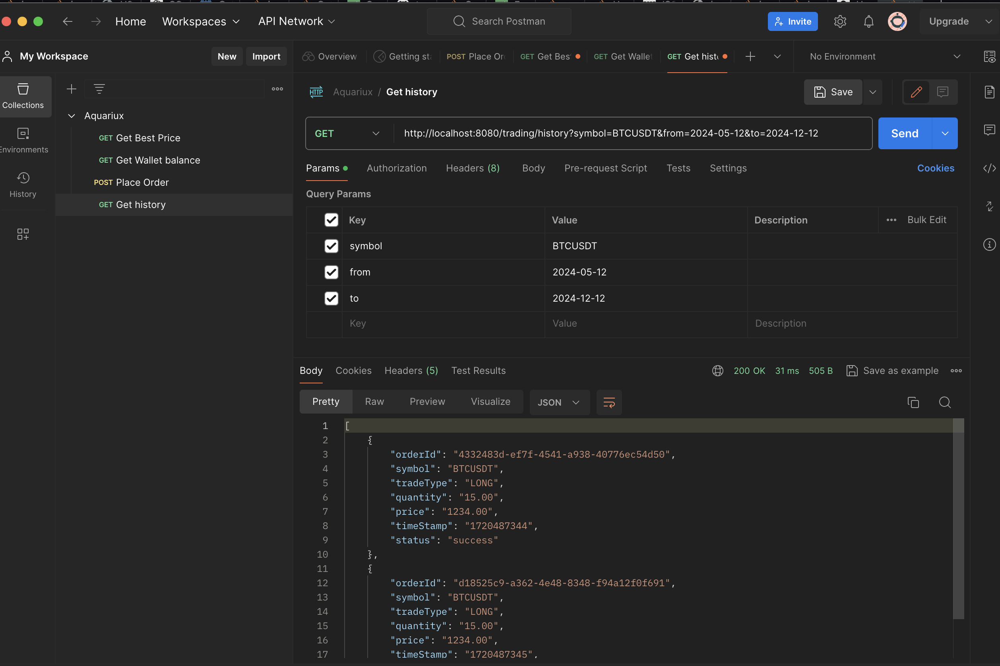

# Aquariux
Aquariux Exam 
# How to run
1. `./gradlew clean build` for build project
2. `docker build -t aquariux .` for build docker image
3. `docker run -p 8080:8080 aquariux` for run docker image

# Feature description
## Postman Collection: 
https://elements.getpostman.com/redirect?entityId=36810555-831df8ad-c76d-44b2-8070-8f39a512cdba&entityType=collection
## Get Price Ticker
1. Every 10s, we will get latest price from Binance, Huobi

2. We can get best price by 

3. We can get wallet balance
 
4. We can place order

5. We can get order history
